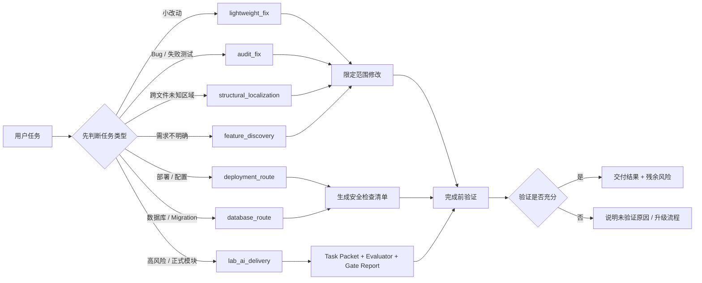
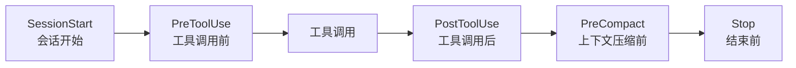

# Production Harness Starter

一套面向 **Codex** 的 AI 开发工作流模板。

当前版本已经完成 Codex 适配。Claude Code、Cursor、Gemini CLI 等环境可以参考这套设计思想，但还没有完成对应的文件结构、Hook 注册和运行时适配，不能当作可直接使用版本。

它解决的问题很简单：

- 什么时候直接改代码，什么时候先问清需求
- 哪些文件、配置、数据库、部署动作不能乱碰
- 修完或开发完以后必须怎么验证
- 什么时候该用 CodeGraph、文档查询、reviewer、debug skill
- 什么时候必须升级到正式交付流程

Production Harness Starter 把这些规则沉淀成轻量路线、护栏和检查清单。默认足够快，遇到高风险任务时自动变谨慎。

## 适配状态

| 平台 | 当前状态 | 说明 |
| --- | --- | --- |
| Codex | 已适配 | 当前仓库以 Codex 使用方式、AGENTS.md、模板和路线文档为主。 |
| Claude Code | 可参考，未适配 | 需要另行补充 Claude Code 的 Hook 注册和目录结构。 |
| Cursor | 可参考，未适配 | 需要转换为 Cursor rules / project instructions。 |
| Gemini CLI | 可参考，未适配 | 需要转换为 Gemini CLI 的项目规则和工具约束。 |

## 这是什么

这是一个面向生产使用的 Agent Harness Starter。

你可以把它复制到普通 Codex 项目里，让 AI 编程智能体具备更清晰的任务路线、更安全的默认行为、更可靠的完成证据。

它不是 eval 平台、benchmark runner、dashboard、CI 系统，也不是部署工具。

核心思路：

```text
任务类型
> 路线选择
> 能力选择
> 限定范围内工作
> 完成前验证
> 轻量记录
> 高风险时升级流程
```

## 整体流程图



## 它增加了什么能力

### Tool Orchestration

Harness 会告诉智能体什么时候该用什么能力：

- `rg`：默认快速搜索
- CodeGraph/MCP：跨文件定位、调用关系、影响范围分析
- `code-audit-fix`：bug 诊断和修复循环
- `openai-docs`：OpenAI / Codex / API 不确定时查官方文档
- reviewer child：边界、安全、权限、部署、数据库等高风险审查
- `lab-ai-delivery`：正式模块交付，包含 Task Packet、Evaluator、Gate Report

### Verification Loops

智能体不能只说“完成了”，必须先验证结果，或者说明为什么无法验证。

普通代码任务可以运行测试、build、lint、typecheck、截图检查或复现命令。

文档和策略任务也要验证，比如 JSON 解析、关键字覆盖、链接检查、`git diff --check`。

### Context And Memory

重要决策写进文件，不依赖聊天记忆。新的智能体可以按这个顺序恢复上下文：

```text
README
> AGENTS.md
> route policy
> task brief
> verification report
> handoff
```

### Guardrails

Harness 会把日常任务和危险任务分开。

数据库写入、生产部署、密钥、权限、破坏性操作、计费、认证、大范围重构，都需要更强证据，并且通常要升级到 reviewer 或 `lab-ai-delivery`。

### Observability

生产项目里的记录应该保持轻量，只记录有用信息：

- 选择了什么路线
- 用了哪些能力
- 改了哪些文件
- 做了哪些验证
- 跳过了哪些检查
- 还剩什么风险

benchmark 字段、对比指标、成本实验、观测平台实验，不应该默认进入普通生产项目，除非你正在明确做评估。

## 路线表

| 任务类型 | 默认路线 | 做什么 |
| --- | --- | --- |
| 小而明确的修改 | `lightweight_fix` | 直接限定范围修改，然后做 focused verification。 |
| bug / failing test | `audit_fix` | 复现、定位、修复、验证。 |
| 不熟悉的跨文件区域 | `structural_localization` | 先用 CodeGraph/MCP 理清结构，再改代码。 |
| 模糊的新功能 | `feature_discovery` | 先澄清需求、简短 brainstorm，再实现。 |
| 中型功能 | `feature_plan` | 先写短计划，再分步实现。 |
| API / 文档不确定 | `docs_assisted` | 先查官方文档，再做决策。 |
| 边界 / 安全 / 权限 | `review_gated` | 独立 reviewer 审查后再接受。 |
| 部署 / 配置 | `deployment_route` | 记录 pre-change evidence、rollback、dry-run、smoke plan。 |
| 数据库 / schema / migration | `database_route` | 做影响预览、backup/rollback、transaction/dry-run、row-count guard。 |
| 正式或高风险模块 | `lab_ai_delivery` | Task Packet、child、evaluator、Gate Report。 |

## 项目结构

```text
your-project/
├── README.md                         项目说明
├── AGENTS.md                         Codex 行为规则
├── .gitignore                        忽略本地配置、密钥和运行产物
├── docs/
│   ├── route-policy.md               任务路线选择
│   ├── capability-policy.md          工具 / MCP / skill 调用策略
│   ├── verification-and-guardrails.md 完成前验证和安全护栏
│   ├── install-hooks-upgrade.md      安装、Hook 思路、升级方式
│   └── context-memory.md             上下文保存和交接
└── templates/
    ├── task-brief.md                 任务简报
    ├── verification-report.md        验证报告
    ├── risk-review.md                高风险审查
    └── handoff.md                    上下文交接
```

## Hook 是什么

Hook 可以理解成“智能体工作过程中的自动检查点”。

它不是一个新的 AI 模型，也不是一个新的工具。它是在某些关键时机自动触发的脚本或规则，用来提醒、拦截、记录或检查。

比如：

- 智能体开始一轮会话时，自动注入项目规则
- 智能体调用工具前，检查是不是要读取 `.env` 或执行危险命令
- 智能体改完文件后，记录改了什么、有没有验证
- 上下文快满时，自动写交接摘要
- 智能体准备结束时，检查有没有 verification report

这套仓库目前没有强制实现 Hook 脚本，只提供 Codex 可用的规则、路线和模板。后续如果要做 Claude Code 或其他平台适配，可以把这些规则接到对应平台的 Hook 机制里。

## Hook 生命周期参考



| Hook | 时机 | 作用 | 当前状态 |
| --- | --- | --- | --- |
| SessionStart | 新会话开始 | 注入 README、AGENTS.md、当前任务说明 | 思路保留，未做脚本适配 |
| PreToolUse | 工具执行前 | 拦截密钥读取、危险命令、未授权生产/数据库动作 | 思路保留，未做脚本适配 |
| PostToolUse | 工具执行后 | 记录改动文件、验证结果、warning | 思路保留，未做脚本适配 |
| PreCompact | 上下文压缩前 | 写 handoff snapshot，方便下个智能体接手 | 思路保留，未做脚本适配 |
| Stop | 结束前 | 要求 verification report 或允许的未验证原因 | 思路保留，未做脚本适配 |

## 成熟度路线

| 等级 | 名称 | 说明 |
| --- | --- | --- |
| L0 | 裸用 | 手动提示，没有模板。 |
| L1 | 规则层 | README + AGENTS.md + 基础行为规则。 |
| L2 | 路线层 | 按任务类型选择不同路线，完成前必须验证。 |
| L3 | 风险层 | 部署、数据库、权限、安全等高风险任务自动升级。 |
| L4 | 自动化 Hook | 把 SessionStart、PreToolUse、Stop 等检查点脚本化。 |
| L5 | 可观测工程 | 轻量 trace、运行数据、外部观测平台、持续改进。 |

当前仓库定位在 **L2-L3**：Codex 可直接使用路线、模板和护栏；Hook 自动化和跨平台适配属于后续工作。

## 快速开始

1. 把这个仓库复制到你的 Codex 项目里，或者把它作为工作流参考。
2. 让 Codex 先读 `README.md` 和 `AGENTS.md`。
3. 每个非简单任务先用 `templates/task-brief.md` 写一个短任务说明。
4. 让 Codex 根据 `docs/route-policy.md` 选择路线。
5. 用 `templates/verification-report.md` 记录完成前验证。
6. 高风险任务使用 `templates/risk-review.md`，必要时升级到 `lab-ai-delivery`。

可以这样对 Codex 说：

```text
使用这个 production harness。
先判断任务路线，选择最小但安全的流程。
完成前必须验证，风险升高时再升级流程。
```

## 不要从 eval 工作里复制什么

普通生产项目默认不要放这些东西：

- benchmark 分数
- 评估对比字段
- 成本实验
- 历史 benchmark 任务
- Langfuse credentials
- 很长的 trace payload
- 研究阶段 caveat

生产记录应该小而有用。

## 如果要做成图片

README 里的 Mermaid 图可以在 GitHub 直接渲染。如果你想用 GPT 生成一张更像宣传页的结构图，可以使用这个提示词：

```text
生成一张中文技术文档风格的深色主题架构图，主题是 Codex Production Harness Starter。
画面包含三部分：
1. 顶部是主流程：用户任务 -> 路线选择 -> 能力选择 -> 限定范围工作 -> 完成前验证 -> 高风险升级。
2. 中部是 Hook 生命周期：SessionStart -> PreToolUse -> 工具调用 -> PostToolUse -> PreCompact -> Stop。
3. 底部是三层结构：路线层、护栏层、验证层。
风格参考 GitHub README 深色模式，线条清晰，中文标签，白色文字，蓝色强调色，简洁专业，不要卡通风。
输出 16:9 横图，适合放在 README 顶部。
```

## 设计理念

好的 Agent 工作流不是“永远使用最大的流程”。

它应该是：

```text
默认足够快
风险升高时变谨慎
对验证诚实
对证据清楚
需要时能升级
```

目标不是拖慢智能体，而是让它知道什么时候该快、什么时候该问、什么时候该验证、什么时候该停。
