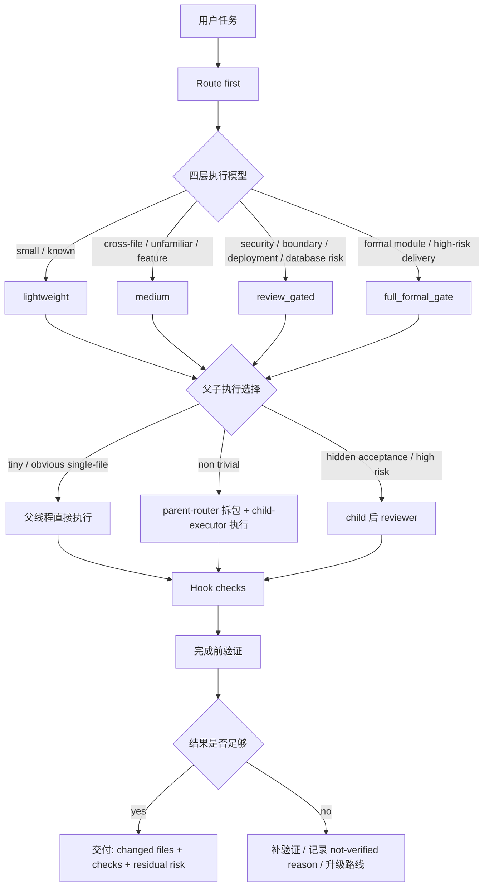

# Codex Production Harness v2.1

这是一个面向 Codex 的轻量生产工作流内核。

它不是 AEL 测试平台，不是 v1 那种完整交付实验室，也不是给 Claude、Cursor、Gemini 直接复用的通用框架。v2.1 的目标很朴素：每天打开 Codex 做真实项目时，小任务足够快，跨文件和新功能足够清楚，高风险任务自动变严，完成前有验证证据，Hook 和脚本负责轻量兜底。

当前版本定位为 `v2.1 production freeze`。完成后建议深度使用一周，只记录真实摩擦和有用点；除非 Hook 误伤正常开发或发现安全问题，一周内不要继续大改。

## 它解决什么

- 先判断任务路线，而不是每次都走最大流程。
- 小任务直接做，非 trivial 任务用 parent-router / child-executor 分摊上下文。
- 新项目首次接入时建立 project profile，并默认尝试 CodeGraph / 结构索引。
- 对 deployment、database、security、permission、secret、browser profile 等边界保持保守。
- Hook-ready 层在 SessionStart、PreToolUse、PostToolUse、PreCompact、SubagentStart、SubagentStop、Stop 做提醒或拦截。
- 每次完成前必须验证，或者记录窄化的未验证理由和残余风险。

## v1 / AEL / v2 的关系

| 项目 | 定位 | v2.1 采用什么 | v2.1 不采用什么 |
| --- | --- | --- | --- |
| v1 | 完整流程实验室，适合未来定制 agent / 完整交付流程实验。 | 保留 `lab-ai-delivery` 作为正式模块路线。 | 不把 Task Packet / Gate Report 变成日常默认。 |
| AEL | 测试、证据和 capability proof 平台。 | 迁入四层路由、能力触发、证据边界、feature/deployment/database 清单。 | 不迁入 benchmark runner、baseline/enhanced 对比、Langfuse 凭证、eval payload。 |
| v2 | Codex 日常生产 harness。 | 轻量路由、父子执行、Hook-ready、脚本检查、一周 pilot。 | 不做大而全平台，不承诺 pass-rate、token、生产力提升。 |

## 主流程



## 四层执行模型

| v2 路线 | 四层模型 | 默认强度 |
| --- | --- | --- |
| `lightweight_fix` | `lightweight` | 小而明确的单文件或已知区域任务，父线程可直接执行。 |
| `audit_fix` | `medium` | bug、失败测试、回归、可疑路径，优先复现和本地验证。 |
| `structural_localization` | `medium` | 跨文件、不熟悉区域，使用 `rg` + CodeGraph/MCP 定位结构。 |
| `docs_assisted` | `medium` | OpenAI / Codex / API / SDK 或当前文档不确定。 |
| `feature_discovery` | `medium` | 需求模糊，先短 brainstorm，再决定是否实现。 |
| `feature_plan` | `medium` | 中型、多步骤、多文件新功能，先写短计划。 |
| `review_gated` | `review_gated` | 边界、安全、权限、public API、hidden acceptance。 |
| `deployment_route` | `review_gated` when risky | 生产配置、部署、reload/restart、CI/CD、证书、环境变量。 |
| `server_inspection` | `review_gated` when prod | 通过已配置的 SSH alias/agent 做只读服务器查询，不接触明文密码。 |
| `database_route` | `review_gated` when risky | schema、migration、SQL、数据修复、导入导出、权限数据。 |
| `branch_finish` | `lightweight` to `review_gated` | 开发完成后准备 commit、push、PR、merge、保留或清理分支。 |
| `lab_ai_delivery` | `full_formal_gate` | 正式模块、高风险交付、需要 Task Packet / Evaluator / Gate Report。 |

日常规则：使用能完成任务并留下证据的最小安全路线。不要把每个小改都变成 formal gate，也不要因为任务看起来小就跳过验证。

## 能力默认值

| 能力 | 默认策略 | 触发 |
| --- | --- | --- |
| `rg` | 默认使用 | 文本、配置、错误、文件定位。 |
| verification | 默认使用 | 每次完成前必须验证或记录窄化未验证理由。 |
| scope_guard | 默认使用 | 完成前检查 changed files、runtime 产物、secrets、越界。 |
| CodeGraph/MCP | medium 以上默认考虑 | 新项目接入、跨文件、不熟悉、结构定位、影响范围。 |
| `code-audit-fix` | 按需 | bug、失败测试、verification_failure、repair_loop、回归、可疑路径。 |
| `openai-docs` | 按需 | OpenAI / Codex / API / SDK / 当前文档不确定。 |
| reviewer | 高风险按需 | boundary、security、permission、API、deployment、database、scope risk、formal。 |
| browser/UI | 按需或 eval/manual only | UI 验证或浏览器行为；默认不要用个人登录态。 |
| `lab-ai-delivery` | formal only | 正式模块、高风险、需要 Task Packet / Evaluator / Gate Report。 |

证据边界：

- CodeGraph 改善结构定位，不保证正确性。
- `code-audit-fix` 改善诊断，不保证自动修复成功。
- reviewer 适合高风险，不适合所有小任务。
- `openai-docs` 对 OpenAI/Codex/API 不确定性有用，不是通用搜索。
- browser/UI 需要专用 profile 或明确授权，默认不要使用个人登录态。

## Parent-router / child-executor

默认心智模型：

- 父线程默认是 router 和 acceptor，不是默认 implementer。
- tiny / obvious single-file：父线程可直接执行。
- 非 trivial：父线程必须先写 child task，child 执行，父线程读取 child report 后验收。
- 跨文件 / 新功能 / 高风险 / 长任务：默认 parent-router + child-executor。
- 高风险 / hidden acceptance：child 完成后再 reviewer。
- 如果当前 Codex surface 无法创建 child/subagent/thread，父线程必须说明限制并请求授权，不要静默自己执行。

相关模板：

- `templates/child-task.md`
- `templates/child-report.md`
- `templates/risk-review.md`
- `templates/verification-report.md`
- `docs/parent-child-execution.md`

## 新项目接入

新项目第一次使用 v2.1 时：

1. 读 `README.md`、`AGENTS.md`、`docs/route-policy.md`、`docs/capability-policy.md`。
2. 用 `templates/project-profile.md` 建立项目画像。
3. 默认尝试 CodeGraph / 结构索引。
4. 如果 CodeGraph 不可用，不阻塞工作，记录 fallback：`rg` + 文件树 + 测试入口 + 依赖/调用关系手动定位。
5. 默认确认 parent-router / child-executor 是否可用；非 trivial 任务必须走 child task / child report。
6. 默认检查是否已有项目服务器 SSH alias；如果有，直接使用 `server_inspection` 做只读查询；如果没有，提示用户先在本机配置一次 alias。
7. 记录包管理器、启动命令、测试命令、构建命令、端口、主要目录、禁止修改区域、数据库边界、部署边界、常用验证命令。

可运行：

```powershell
.\scripts\init-project-profile.ps1 -ProjectName "my-project"
.\scripts\check-codegraph.ps1
.\scripts\server-inspection-check.ps1 -HostAlias "my-prod-alias"
```

## Hook-ready 状态

Codex 官方 hooks 支持 repo 内 `.codex/hooks.json` 和 `.codex/config.toml`；项目本地 hooks 需要在 Codex 中 review/trust 后才会运行。v2.1 提供的是 repo 内 `hook-ready` 层，不修改你的全局 Codex 配置，也不声称自动生效。

本仓库包含：

```text
.codex/hooks.json
.codex/hooks/harness-hook.ps1
```

覆盖事件：

| Hook | 作用 |
| --- | --- |
| SessionStart | 检查 README/AGENTS/project-profile/route docs 是否存在，提示读取顺序和当前规则。 |
| PreToolUse | 拦截或提醒 `.env`、secrets、危险删除、数据库写入、远程部署、生产命令、个人浏览器状态。 |
| PostToolUse | 记录 changed files、运行产物、scope drift、疑似 secret/runtime artifacts。 |
| SubagentStart | 给 child 注入 child-task、允许文件、禁止文件、验证要求。 |
| SubagentStop | 要求 child 输出 changed files、验证、风险、下一步。 |
| PreCompact | 要求写 handoff snapshot。 |
| Stop | 检查 verification result 或允许的 not-verified reason；缺失则要求补充。 |

启用方式见 `docs/install-hooks-upgrade.md`。核心边界：`PreToolUse` 可以拦截 Bash、`apply_patch` 和 MCP guardrail，但不能当完整安全边界。

## 快速开始

```powershell
.\scripts\health-check.ps1
.\scripts\check-codegraph.ps1
```

对 Codex 说：

```text
使用这个 v2.1 production harness。先 route first，选择最小安全路线。
非 trivial 任务用 parent-router / child-executor。
完成前运行验证；无法验证时记录允许的 not-verified reason 和 residual risk。
```

做任务时：

1. 非 trivial 任务先用 `templates/task-brief.md`。
2. 新项目先用 `templates/project-profile.md`。
3. 中型 feature 用 `templates/feature-plan.md`。
4. 部署相关用 `templates/deployment-checklist.md`。
5. 只读服务器查询用 `templates/server-inspection.md` 和 `scripts/server-inspection-check.ps1`。
6. 数据库相关用 `templates/database-checklist.md`。
7. 准备 push/PR/merge/清理分支前用 `templates/branch-finish.md` 和 `scripts/branch-finish-check.ps1`。
8. 完成前用 `templates/verification-report.md` 或同等结构报告。

## Server inspection

`server_inspection` 用来解决新项目接入时的效率问题：Codex 可以自己查询服务器文件、进程、日志摘要和配置状态，但前提是访问方式已经由人类在本机配置好，且命令不包含明文密码。

新项目默认流程：

```text
检查是否给了 server alias
> 有 alias：运行 server-inspection-check，成功后直接做只读查询
> 没有 alias：提示用户在 Windows SSH config 配置一次 alias
> alias 配好后：以后所有项目窗口都复用 alias
```

允许：

- 使用 SSH config host alias 或 SSH agent。
- 使用 `ssh -o BatchMode=yes <alias> '<read-only command>'`。
- 查询文件存在性、版本、进程状态、只读配置片段、日志摘要。
- 记录红acted evidence 和命令摘要。

不允许：

- 从截图读取服务器密码。
- 把密码、token、私钥、`.env` 值写进命令、文件、Hook、报告或终端历史。
- 使用 `sshpass` 或交互式密码输入让 Codex 接触密码。
- 执行 deploy、restart、reload、写文件、数据库写入、权限变更。

建议命令里加注释标记，便于 Hook 识别：

```powershell
ssh -o BatchMode=yes my-prod-alias "hostname; uptime" # harness:server-inspection
```

## Branch finish

`branch_finish` 接入的是 Superpowers `finishing-a-development-branch` 的收尾思想：先验证，再看分支和 worktree 状态，然后给出 push/PR、保留、merge、discard/delete 等选项。它不是新的重流程，也不是每次保存文件都要跑。

默认规则：

- tests/checks 没过时，不把 merge/PR 说成 ready。
- `git status`、当前分支、base branch、remote、worktree 类型要先看清。
- PR/merge 后仍保留 worktree，方便处理反馈。
- 删除分支、移除 worktree、discard 变更前必须有明确确认。
- GitHub remote 才建议 `gh pr create`，否则只给通用 push/PR 建议。

## 一周 production pilot

使用 `docs/production-pilot.md` 记录真实情况：

- 哪次 Hook 有用。
- 哪次 Hook 打扰。
- 哪条路线不清楚。
- 哪次 CodeGraph / skill / reviewer 真有帮助。
- 哪次流程过重。
- 需要新增什么。
- 需要删除什么。

一周内只记账，不扩平台。除非 Hook 误伤正常开发或出现安全问题，否则不要继续大改。

## 明确不迁入

v2.1 不迁入：

- AEL benchmark runner
- marked calibration
- P58-P63 外部 proof 平台重流程
- baseline/enhanced 每任务对比
- Langfuse credentials
- token 成本实验字段
- 大规模 trace payload
- 完整 Gate Report 默认流程
- 完整 harness-core 状态机
- Docker/VM/Langfuse 平台部署逻辑

Langfuse/trace 只保留为可选观测适配说明，不进入默认生产负担。
