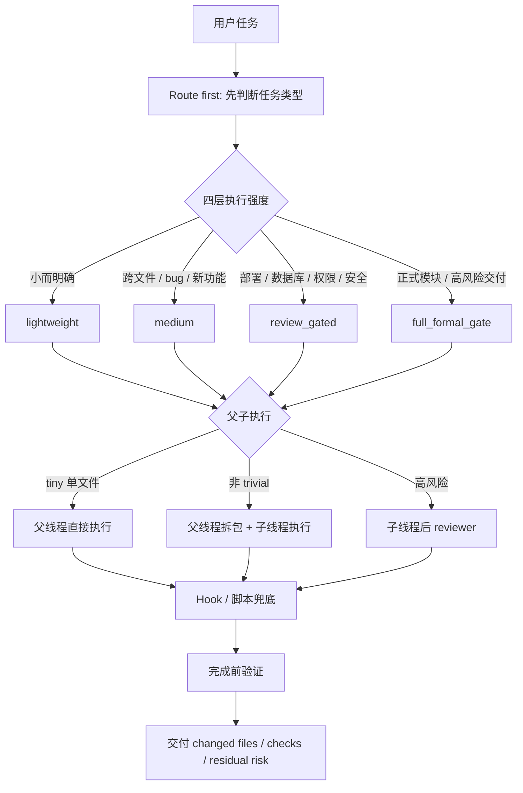

# Codex Production Harness

一个面向 Codex 的轻量生产工作流仓库。

它解决的问题很直接：让 Codex 在真实项目里更稳定地完成日常开发、排障、跨文件修改、部署前检查和收尾提交。小任务不变重，复杂任务不乱跑，高风险任务会自动升级，完成前必须留下验证证据。

适合这些场景：

- 你每天用 Codex 维护多个真实项目。
- 你希望新项目第一次接入后，后续窗口自动遵守同一套规则。
- 你希望 Codex 能区分小改、bug、新功能、部署、数据库、正式模块。
- 你希望跨文件或高风险任务默认拆给子线程执行，父线程负责验收。
- 你希望 Hook 和脚本帮忙提醒 secrets、越界改动、未验证收尾、生产操作风险。

这个仓库不是通用 Agent 框架，也不是评测平台。它的定位是：**Codex 日常生产工作流内核 + 按需增强能力 + Hook/脚本轻量兜底**。

## 一眼看懂



## 接入后能解决什么

| 问题 | 接入后的默认做法 |
| --- | --- |
| Codex 一上来就直接改，缺少路线判断 | 每次先选 route：小改、bug、新功能、部署、数据库、正式模块分开处理。 |
| 小任务被流程拖慢 | `lightweight_fix` 允许父线程直接做，只保留必要验证。 |
| 跨文件任务上下文爆掉 | 非 trivial 任务默认 parent-router / child-executor：父线程拆包，子线程执行，父线程验收。 |
| 新项目每次都要重复解释规则 | 接入时把协议写进项目根 `AGENTS.md`，新窗口会自动读取。 |
| 高风险改动缺少刹车 | 部署、数据库、权限、安全、生产服务器相关任务自动升级到更严格路线。 |
| 完成时没有证据 | 默认要求验证结果，无法验证时必须记录窄化理由和残余风险。 |
| 容易误碰 secrets / runtime 产物 | Hook-ready 层和 scope/health/stop 脚本做轻量检查。 |
| 开发完成后不知道该 push、PR、保留还是清理 | `branch_finish` 会先看测试、分支、远端、worktree，再给收尾选项。 |

## 核心模块

| 模块 | 文件 / 目录 | 作用 |
| --- | --- | --- |
| Durable Instructions | `AGENTS.md` | 仓库级持久规则：路线选择、父子执行、能力触发、验证、边界。 |
| Route Policy | `docs/route-policy.md` | 定义任务路线和四层执行强度，避免所有任务都走同一种流程。 |
| Capability Policy | `docs/capability-policy.md` | 说明什么时候用 `rg`、CodeGraph/MCP、reviewer、browser/UI、OpenAI docs 等能力。 |
| Parent / Child | `docs/parent-child-execution.md` | 规定非 trivial 任务默认父线程拆包、子线程执行、父线程验收。 |
| Project Adoption | `templates/project-agents.md`、`templates/project-profile.md` | 让新项目真正接入规则，而不是只在聊天里临时提醒。 |
| Hooks | `.codex/hooks.json`、`.codex/hooks/` | Codex hook-ready 层，负责启动提醒、工具前后检查、停止前验证提醒。 |
| Scripts | `scripts/` | 健康检查、范围检查、停止检查、CodeGraph 检查、server alias 检查、branch finish 检查。 |
| Templates | `templates/` | 子任务、子报告、功能计划、部署清单、数据库清单、验证报告、handoff 等轻量模板。 |
| Server Inspection | `templates/server-inspection.md`、`scripts/server-inspection-check.ps1` | 通过已配置 SSH alias 做只读服务器巡检，不接触明文密码。 |
| Branch Finish | `templates/branch-finish.md`、`scripts/branch-finish-check.ps1` | 开发完成后做验证、分支、远端、worktree 状态检查，再决定 push/PR/保留/清理。 |
| Production Pilot | `docs/production-pilot.md` | 一周试用期间只记录哪些规则有用、打扰、过重或需要删改。 |

## 四层执行模型

| 执行层 | 适用任务 | 默认要求 |
| --- | --- | --- |
| `lightweight` | 清晰小改、单文件修正、已知位置文档调整 | 父线程可直接执行，仍需验证或说明未验证原因。 |
| `medium` | bug、失败测试、跨文件定位、新功能、文档/API 不确定 | 默认结构定位、必要时子线程执行，完成前跑 focused checks。 |
| `review_gated` | 安全、权限、部署、数据库、生产服务器、hidden acceptance | 需要更明确的证据、边界、回滚/备份思路，必要时 reviewer。 |
| `full_formal_gate` | 正式模块、高风险交付、需要完整验收的工作 | 使用更完整的任务包、验收和报告流程。 |

常用 route：

| Route | 用途 |
| --- | --- |
| `lightweight_fix` | 小而明确的单文件改动。 |
| `audit_fix` | bug、失败测试、回归、可疑路径。 |
| `structural_localization` | 不熟悉区域、跨文件定位、影响范围判断。 |
| `feature_discovery` | 需求还模糊，先澄清/brainstorm。 |
| `feature_plan` | 中型或多文件新功能。 |
| `docs_assisted` | OpenAI / Codex / API / SDK 文档不确定。 |
| `review_gated` | 安全、权限、边界、public API、hidden acceptance。 |
| `deployment_route` | 配置、部署、reload/restart、CI/CD、证书、环境变量。 |
| `server_inspection` | 已配置 alias 的只读服务器查询。 |
| `database_route` | schema、migration、SQL、数据修复、导入导出。 |
| `branch_finish` | commit、push、PR、merge、保留或清理前的收尾检查。 |
| `lab_ai_delivery` | 正式模块或高风险交付。 |

## 新项目接入

只在聊天里说“参考这个工作流仓库”不算完整接入。要让新 Codex 窗口持续遵守规则，必须把协议写进目标项目根 `AGENTS.md`，并建立项目画像。

在本仓库中运行：

```powershell
.\scripts\init-project-profile.ps1 -ProjectPath "D:\path\to\project" -ProjectName "my-project" -InstallAgents
```

这会做两件事：

- 在目标项目生成或更新 `docs/project-profile.md`。
- 在目标项目根 `AGENTS.md` 创建或追加 production harness 协议块。

如果目标项目已有自己的 `AGENTS.md`，脚本会追加带标记的 harness block，不会覆盖原有规则。已有项目规则仍然优先。

接入后建议继续检查：

```powershell
.\scripts\check-codegraph.ps1
.\scripts\server-inspection-check.ps1 -HostAlias "my-prod-alias"
```

## 新项目提示词

可以在新项目 Codex 窗口直接发送：

```text
请接入我的 Codex 生产工作流仓库：D:\个人工作流-v2

先读取该仓库的 README.md、AGENTS.md、docs/install-hooks-upgrade.md，然后在当前项目执行新项目接入：

1. 使用 D:\个人工作流-v2\scripts\init-project-profile.ps1 为当前项目生成 docs/project-profile.md，并使用 -InstallAgents 安装项目根 AGENTS.md 协议。
2. 检查当前项目是否已有 server alias；有则记录到 project-profile，并走 server_inspection 只读巡检；没有则提示我先配置 alias。
3. 检查 CodeGraph/结构索引是否可用；不可用就记录 fallback。
4. 后续非 trivial 任务默认走 parent-router + child-executor，父线程只负责拆包、验收和最终报告；tiny 单文件任务才允许父线程直接执行。
5. 完成后告诉我接入了哪些文件、当前 route、可用验证命令和剩余缺口。

不要读取或保存 secrets，不要执行生产写入/部署/数据库修改，除非我单独授权。
```

## 父线程 / 子线程怎么用

默认规则：

- tiny / obvious single-file：父线程可直接执行。
- 非 trivial：父线程先写 child task，子线程执行，父线程读 child report 后验收。
- 跨文件 / 新功能 / 高风险 / 长任务：默认 parent-router + child-executor。
- 高风险 / hidden acceptance：child 完成后再 reviewer。
- 如果当前 Codex surface 不能创建 child/subagent/thread，父线程必须说明限制并请求授权，不要静默改成父线程全包。

相关模板：

- `templates/child-task.md`
- `templates/child-report.md`
- `templates/risk-review.md`
- `templates/verification-report.md`

## Hook-ready 层

本仓库提供 repo-local hook-ready 配置：

```text
.codex/hooks.json
.codex/hooks/harness-hook.ps1
```

Hook 是提醒和轻量 guardrail，不是完整安全边界。项目本地 hooks 需要在 Codex 中 review/trust 后才会运行。

| Hook | 作用 |
| --- | --- |
| SessionStart | 提醒读取 README/AGENTS/project-profile/route docs 和当前规则。 |
| PreToolUse | 拦截或提醒 `.env`、secrets、危险删除、数据库写入、远程部署、生产命令、个人浏览器状态。 |
| PostToolUse | 记录 changed files、运行产物、scope drift、疑似 secret/runtime artifacts。 |
| SubagentStart | 给 child 注入 child-task、允许文件、禁止文件、验证要求。 |
| SubagentStop | 要求 child 输出 changed files、验证、风险、下一步。 |
| PreCompact | 要求写 handoff snapshot。 |
| Stop | 检查 verification result 或允许的 not-verified reason。 |

启用和升级方式见 `docs/install-hooks-upgrade.md`。

## 脚本

| 脚本 | 作用 |
| --- | --- |
| `scripts/health-check.ps1` | 检查仓库必需文件、Hook、脚本语法、模板和常见风险。 |
| `scripts/scope-check.ps1` | 检查 changed files、secrets 文件名、runtime/IDE 产物。 |
| `scripts/stop-check.ps1` | 检查是否有验证报告或允许的未验证理由。 |
| `scripts/init-project-profile.ps1` | 给目标项目生成项目画像，并可安装根 `AGENTS.md` 协议块。 |
| `scripts/check-codegraph.ps1` | 检查 CodeGraph 是否可用，不可用时输出 fallback。 |
| `scripts/server-inspection-check.ps1` | 检查 SSH alias 是否可用于只读服务器巡检。 |
| `scripts/branch-finish-check.ps1` | 收尾前检查分支、远端、worktree、scope 和测试命令。 |

## 服务器巡检

`server_inspection` 解决的是“新项目代码在服务器上，Codex 需要先只读定位”的效率问题。

允许：

- 使用已配置的 SSH config host alias 或 SSH agent。
- 使用 `ssh -o BatchMode=yes <alias> "<read-only command>"`。
- 查询文件存在性、版本、进程状态、只读配置片段、日志摘要。
- 记录 redacted evidence 和命令摘要。

不允许：

- 从截图读取服务器密码。
- 把密码、token、私钥、`.env` 值写进命令、文件、Hook、报告或终端历史。
- 使用 `sshpass` 或交互式密码输入让 Codex 接触密码。
- 未经授权执行 deploy、restart、reload、写文件、数据库写入、权限变更。

建议命令里加标记，方便 Hook 识别：

```powershell
ssh -o BatchMode=yes my-prod-alias "hostname; uptime" # harness:server-inspection
```

## 完成前验证

不要在没有证据时说“完成”。最小报告应包含：

- route selected
- direct execution exception used: yes/no
- child report summary 或 child unavailable reason
- files changed
- commands/checks run
- skipped checks and reason
- residual risk

## 快速自检

在本仓库运行：

```powershell
.\scripts\health-check.ps1
.\scripts\branch-finish-check.ps1 -TestCommand "powershell -NoProfile -ExecutionPolicy Bypass -File .\scripts\health-check.ps1"
```

## 版本状态

当前版本：`v2.1 production freeze`

建议接入后连续使用一周，只在 `docs/production-pilot.md` 记录真实摩擦和收益。除非 Hook 误伤正常开发或出现安全问题，不要频繁扩大流程。
